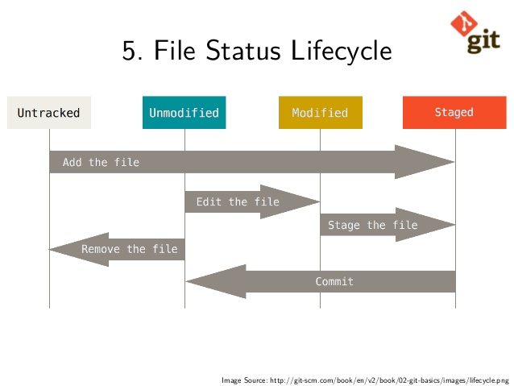
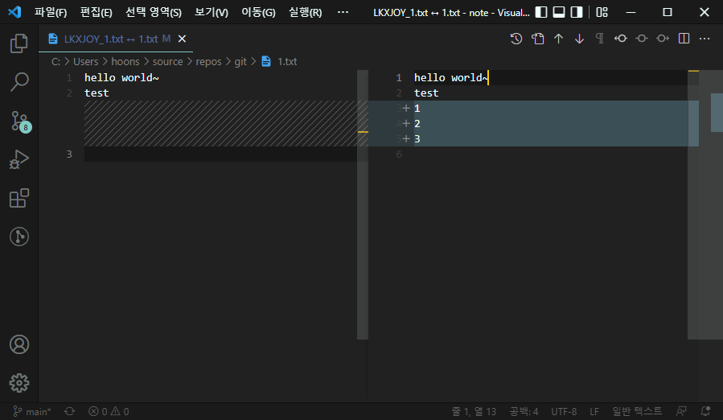
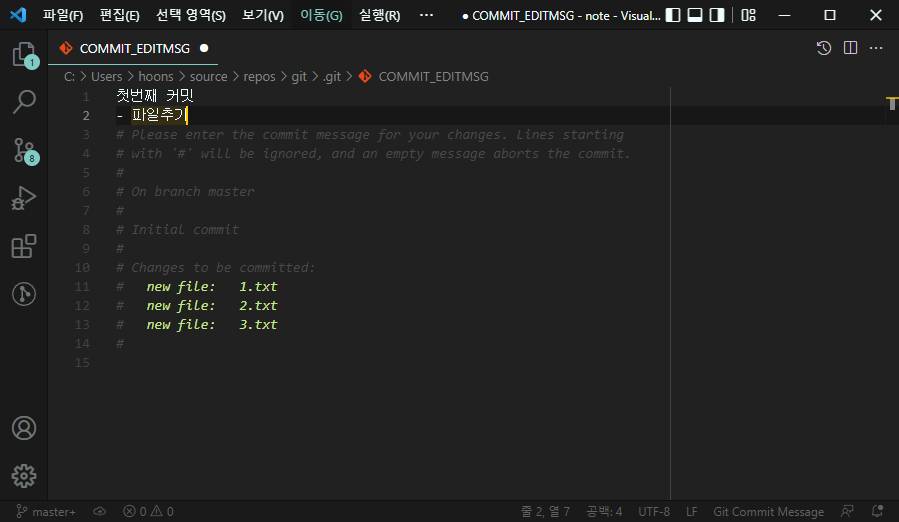

# Git

## Git Setup

1. 모든 설정 확인
   ```
   $ git config --list
   ```
2. 에디터로 글로벌 설정 열기
   ```
   $ git config --global -e
   ```
3. 에디터 변경
   ```
   $ git config --global core.editor "code"
   ```
4. 에디터가 종료될 때까지 대기
   ```
   $ git config --global core.editor "code --wait"
   ```
5. user name/email 설정
   ```
   $ git config --global user.name "kim_t"
   $ git config --global user.email "taehoon-a.kim@rohde-schwarz.com"
   ```
6. CRLF
   - Windows
     ```
     $ git config --global core.autocrlf true
     ```
   - Mac/Linux
     ```
     $ git config --global core.autocrlf input
     ```
     

## Git Documentation

[Reference site](https://git-scm.com/docs)\
Reference 사이트에서는 Git에서 이용가능한 모든 명령어 확인 가능

## Git Workflow

### Workflow


### File Status



### 관련 커맨드

0. git clone / git pull
   `remote repository`의 저장사항을 `working directory`로 가져온다.
   처음으로 데이터를 가져오는 경우 `git clone`을 사용하며,\
   `working directory`가 만들어진 이후로는 `git pull`을 사용한다.

   ```
   $ git clone {remote repository 주소}
   $ git pull
   ```

1. git status / git add

   git working directory에 파일을 추가한 후 `git status` 확인\

   ```basic
   $ git status
   On branch master

   No commits yet

   Untracked files:
   (use "git add <file>..." to include in what will be committed)
        1.txt
        2.txt
        3.txt

   nothing added to commit but untracked files present (use "git add" to track)
   ```

   커밋을 하기 위해서는 `git add`를 통해 파일을 추가해주어야한다.\
   `git add`를 통해 `1.txt`파일을 추가해주고\

   ```basic
   $ git add 1.txt
   warning: LF will be replaced by CRLF in 1.txt.
   The file will have its original line endings in your working directory
   ```

   `git status`를 확인해보면 아래와 같이 출력된다.\

   ```basic
   $ git status
   On branch master

   No commits yet

   Changes to be committed:
   (use "git rm --cached <file>..." to unstage)
         new file:   1.txt

   Untracked files:
   (use "git add <file>..." to include in what will be committed)
         2.txt
         3.txt
   ```

   현재 경로 아래 모든 modified파일을 statge에 추가하기 위해서는 `git add .`를 통해 추가할 수 있다.\

   ```basic
   $ git add .
   warning: LF will be replaced by CRLF in 2.txt.
   The file will have its original line endings in your working directory
   warning: LF will be replaced by CRLF in 3.txt.
   The file will have its original line endings in your working directory

   $ git status
   On branch master

   No commits yet

   Changes to be committed:
   (use "git rm --cached <file>..." to unstage)
         new file:   1.txt
         new file:   2.txt
         new file:   3.txt
   ```

   이 상태에서 `1.txt`파일을 수정한 후, `git status`를 확인해보면,\
   아래와 같이 수정 내용을 커밋하기 위해서는 `1.txt`파일을 `git add`커맨드를 통해서 stage에 다시 추가해야한다.

   ```basic
   $ git status
   On branch master

   No commits yet

   Changes to be committed:
   (use "git rm --cached <file>..." to unstage)
         new file:   1.txt
         new file:   2.txt
         new file:   3.txt

   Changes not staged for commit:
   (use "git add <file>..." to update what will be committed)
   (use "git restore <file>..." to discard changes in working directory)
         modified:   1.txt
   ```

2. git rm --cached

   추가로 stage의 수정사항을 unstage로 다시 변경하기 위해서는 `git rm --cached`커맨드를 통해 변경할 수 있다.

   ```basic
   $ git rm --cached *
   rm '1.txt'
   rm '2.txt'
   rm '3.txt'

   $ git status
   On branch master

   No commits yet

   Untracked files:
   (use "git add <file>..." to include in what will be committed)
         1.txt
         2.txt
         3.txt

   nothing added to commit but untracked files present (use "git add" to track)
   ```

3. .gitignore

   `git add`를 통해서 `tracking`하고싶지 않은 파일 및 폴더를 정리하기 위해,\
   `Working Directory`에 `.gitignore` 파일을 만들고 제외할 파일 및 폴더를 정해준다.\

   ```
   *.log
   *.csv
   *.html
   *.pdf

   /log
   /results/*.csv
   ```

4. git diff

   `staging area`와 `working directory`의 변경점을 확인하기 위해 `git diff`를 사용한다.

   ```basic
   $ git diff
   diff --git a/1.txt b/1.txt
   index bca53f6..c2134b3 100644
   --- a/1.txt
   +++ b/1.txt
   @@ -1 +1,2 @@
   hello world~
   +test
   ```

   - a/1.txt : `staging area`의 `1.txt`
   - b/1.txt : `working directory`의 `1.txt`
   - @@ -1 +1,2 @@\
      \- : 이전 파일\
      1 : 번째줄\
      \+ : 변경 파일\
      1,2 : 1번째줄부터 2번째줄까지

   터미널에서 확인하는게 힘들다면, `vscode`로 `git diff`를 연결할 수 있다.

   ```
   $ git config --global -e
   ```

   ```
   [user]
   name = kim_t
   email = taehoon-a.kim@rohde-schwarz.com
   [core]
      editor = code --wait
      autocrlf = true
   [diff]
      tool = vscode
   [difftool "vscode"]
      cmd = code --wait --diff $LOCAL $REMOTE
   ```

   설정을 완료하였으면, `git difftool`을 통해서 `vscode`를 통해서 변경사항을 확인할 수 있다.

   ```basic
   $ git difftool
   warning: LF will be replaced by CRLF in 1.txt.
   The file will have its original line endings in your working directory

   Viewing (1/1): '1.txt'
   Launch 'vscode' [Y/n]? Y
   ```

   

5. git commit
   `staging area`의 파일을 `local repository`로 이동시키기 위해서 `git commit`을 이용한다.

   ```
   $ git commit
   ```

   `git commit`명령어를 입력하면 `vscode`에서 커밋 메시지를 작성할 수 있다.  
   
   커밋 메시지를 작성한 후 저장하고 닫으면, 아래와 같이 커밋이 완료된 것을 볼 수 있다.

   ```
   $ git commit
   [master (root-commit) 144f98a] 첫번째 커밋 - 파일추가
   3 files changed, 7 insertions(+)
   create mode 100644 1.txt
   create mode 100644 2.txt
   create mode 100644 3.txt
   ```

   또는 `-m`옵션을 이용해서 간단하게 커밋을 할 수 있다.

   ```
   $ git commit -m "second commit"
   [master 3f6b4d7] second commit
   1 file changed, 1 insertion(+)
   ```

6. git log
   현재까지 커밋된 모든 로그를 보고 싶은 경우 `git log` 커맨드를 이용한다.

   ```
   $ git log
   commit 3f6b4d77c43053bd061d951686c9d63180f6d105 (HEAD -> master)
   Author: kim_t <taehoon-a.kim@rohde-schwarz.com>
   Date:   Wed Jun 1 14:58:57 2022 +0900

      second commit

   commit 144f98acdf3c246dca575c32fefb2afaed962b20
   Author: kim_t <taehoon-a.kim@rohde-schwarz.com>
   Date:   Wed Jun 1 14:52:05 2022 +0900

      첫번째 커밋
      - 파일추가
   ```

   로그 메시지는 init/add/fix + 명사의 형태로 작성한다.\
   ex) init project, add login module, add about page, fix crashing on login module

7. git push

   `local repository`의 저장사항을 `remote repository`로 저장한다.

   ```
   $ git push
   ```
