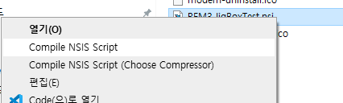
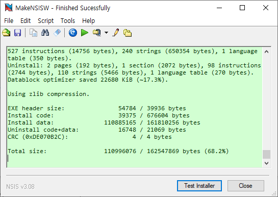

# Install Sheild Guide

## 설치파일

[NSIS](https://sourceforge.net/projects/nsis/files/NSIS%203/3.08/nsis-3.08-setup.exe/download?use_mirror=jaist&download=)

## 사용법

[NSIS 사용자 설명서](https://opentutorials.org/module/3650/21912)

- 스크립트 생성 후 마우스 우클릭 `Compile NSIS Script`클릭
  
- 정상적으로 완료 시 바탕화면이 초록색으로 변경됨
  

## 샘플

```nsis
unicode true
!define CGODISPLAYNAME        "R&S Korea JigBox Test"
!define XCGODISPLAYNAME       "R&&S Korea JigBox Test"

!define ICON                  "RSKSW_Icon_64x64.ico"
!define UNICON                "modern-uninstall.ico"
!define CGOUNINSTALLER        "Uninstall.exe"
!define TMPLUNINSTALLER       "Uninstall.exe"
!define CGOSOURCEDIR          "D:\Source\C#\Workspace\SVN\source_kth\JOB.RFM3.JigBoxTest\Src\RFM3.JigBoxTest\bin\Release"
!define CGOINSTALLDIR         "C:\Rohde-Schwarz Korea\JigBox Test"
!define CGOUNINSTALLKEY       "Software\Microsoft\Windows\CurrentVersion\Uninstall\R&S Korea MIMO Antenna Measure"
!define TEMPOUTPATH           "D:\Source\C#\Workspace\SVN\source_kth\Release\RFM3.JigBoxTest\Release"

RequestExecutionLevel admin

;--------------------------------
; Essential object
!include "MUI.nsh"
!include "WordFunc.nsh"
!include "Library.nsh"
!include "StrFunc.nsh"

XPStyle on

;--------------------------------
; The name of the installer
Name "${CGODISPLAYNAME}" "${XCGODISPLAYNAME}"

;--------------------------------
; The file to write
OutFile "${TEMPOUTPATH}\RSK_JigBox_Test_Install_v1.2.exe"

;--------------------------------
Icon          ${ICON}
UninstallIcon ${UNICON}

;--------------------------------
;Interface Settings

!define MUI_HEADERIMAGE
!define MUI_HEADERIMAGE_RIGHT
!define MUI_ABORTWARNING
!define MUI_ICON   ${ICON}
!define MUI_UNICON ${UNICON}

BrandingText " "

;**********************************************************************************
;* Installer
;**********************************************************************************
Function .onInit

    UserInfo::GetAccountType
        pop $0
        ${If} $0 != "admin" ;Require admin rights on NT4+
            MessageBox mb_iconstop "Administrator rights required!"
            SetErrorLevel 740 ;ERROR_ELEVATION_REQUIRED
            Quit
        ${EndIf}

    SetShellVarContext all
    ; Create Uninstaller
    CreateDirectory "${CGOINSTALLDIR}"
    CreateDirectory "${CGOINSTALLDIR}\Supported Files"
    WriteUninstaller "${CGOINSTALLDIR}\${CGOUNINSTALLER}"

    ; Create uninstaller entry in registry
    WriteRegStr   HKLM "${CGOUNINSTALLKEY}"  "DisplayName"      "${CGODISPLAYNAME}"
    WriteRegStr   HKLM "${CGOUNINSTALLKEY}"  "UninstallString"  "${CGOINSTALLDIR}\${CGOUNINSTALLER}"
    WriteRegStr   HKLM "${CGOUNINSTALLKEY}"  "DisplayIcon"      "${CGOINSTALLDIR}\${ICON}"
    WriteRegStr   HKLM "${CGOUNINSTALLKEY}"  "DisplayVersion"   "1.0.0.0"
    WriteRegStr   HKLM "${CGOUNINSTALLKEY}"  "Publisher"        "Rohde & Schwarz Korea"
    WriteRegStr   HKLM "${CGOUNINSTALLKEY}"  "HelpLink"         "http://rohde-schwarz.com"

FunctionEnd

;Pages
!insertmacro MUI_PAGE_WELCOME
!insertmacro MUI_PAGE_LICENSE "TermsOfUseRSK.rtf"
!insertmacro MUI_PAGE_COMPONENTS
!insertmacro MUI_PAGE_INSTFILES
!insertmacro MUI_PAGE_FINISH

!insertmacro MUI_UNPAGE_COMPONENTS
!insertmacro MUI_UNPAGE_INSTFILES

;Languages
!insertmacro MUI_LANGUAGE "Korean"

; output directory for installable
!system "mkdir ${TEMPOUTPATH}"

; Microsoft.NET Framework
Section "Microsoft .NET Framework v4.0" Sec_DotNet_FrameWork

    SetShellVarContext all

    IfFileExists "$WINDIR\Microsoft.NET\Framework\v4.0.30319" NETFrameworkInstalled 0
        CreateDirectory "${CGOINSTALLDIR}\Supported Files\Microsoft.NET\v4.0.30319"
        SetOutPath "${CGOINSTALLDIR}\Supported Files\Microsoft.NET\v4.0.30319"
        File /r "${CGOSOURCEDIR}\Supported Files\Microsoft.NET\v4.0.30319\"

        DetailPrint "Starting Microsoft .NET Framework v4.0 Setup..."
        ExecWait "${CGOINSTALLDIR}\Supported Files\Microsoft.NET\v4.0.30319\dotNetFx40_Full_x86_x64.exe"
    Return

    NETFrameworkInstalled:
        DetailPrint "Microsoft .NET Framework is already installed!"

SectionEnd

; R&S VISA
Section "R&S VISA v5.8.5" Sec_RS_VISA

    SetShellVarContext all

    CreateDirectory "${CGOINSTALLDIR}\Supported Files\R&S VISA"
    SetOutPath "${CGOINSTALLDIR}\Supported Files\R&S VISA"
    File /r "${CGOSOURCEDIR}\Supported Files\R&S VISA\"

    DetailPrint "Starting R&S VISA v5.8.5 Setup..."
    ExecWait "${CGOINSTALLDIR}\Supported Files\R&S VISA\RS_VISA_Setup_Win_5_8_5.exe"

SectionEnd

; Software License
Section "R&S Korea Software License" Sec_Software_License

    SectionIn RO

    SetOutPath "$WINDIR\System32"
    File /r "${CGOSOURCEDIR}\hasp_windows_109393.dll"
    File /r "${CGOSOURCEDIR}\hasp_windows_x64_109393.dll"
    File /r "${CGOSOURCEDIR}\haspdnert.dll"
    File /r "${CGOSOURCEDIR}\haspdnert_x64.dll"

SectionEnd

; Software Copy
Section "R&S JigBox Test" Sec_Software_Copy

    SectionIn RO

    SetShellVarContext all

    ; Program
    SetOutPath "${CGOINSTALLDIR}"
    File /r "${CGOSOURCEDIR}\RFM3.JigBoxTest.exe"
    File /r "${CGOSOURCEDIR}\RFM3.JigBoxTest.ttf"
    File /r "${CGOSOURCEDIR}\RFM3.JigBoxTest.ttf.bat"
    File /r "${CGOSOURCEDIR}\hasp_windows_109393.dll"
    File /r "${CGOSOURCEDIR}\hasp_windows_x64_109393.dll"
    File /r "${CGOSOURCEDIR}\haspdnert.dll"
    File /r "${CGOSOURCEDIR}\haspdnert_x64.dll"

    ; Font
    ExecWait "${CGOINSTALLDIR}\RFM3.JigBoxTest.ttf.bat"

    SetOutPath "${CGOINSTALLDIR}"
SectionEnd

; Shortcut
Section "R&S Korea JigBox Test Shortcut" Sec_ShortCut

    SectionIn RO

    CreateDirectory "$SMPROGRAMS\R&S Korea\JigBox Test"
    CreateShortCut  "$SMPROGRAMS\R&S Korea\JigBox Test\R&S Korea JigBox Test.lnk" "${CGOINSTALLDIR}\RFM3.JigBoxTest.exe" "" "${CGOINSTALLDIR}\RFM3.JigBoxTest.exe" 0
    CreateShortCut  "$SMPROGRAMS\R&S Korea\JigBox Test\Uninstall.lnk" "${CGOINSTALLDIR}\${CGOUNINSTALLER}" "" "${CGOINSTALLDIR}\${CGOUNINSTALLER}" 0
    CreateShortCut  "$DESKTOP\R&S Korea JigBox Test.lnk" "${CGOINSTALLDIR}\RFM3.JigBoxTest.exe" "" "${CGOINSTALLDIR}\RFM3.JigBoxTest.exe" 0

SectionEnd
;Korean
; Descriptions
LangString DESC_Sec_DotNet_FrameWork    ${LANG_KOREAN} "Microsoft .NET Framework v4.0"
LangString DESC_Sec_RS_VISA             ${LANG_KOREAN} "R&S VISA v5.8.5"
LangString DESC_Sec_Software_License    ${LANG_KOREAN} "R&&S Korea Software License"
LangString DESC_Sec_Software_Copy       ${LANG_KOREAN} "R&&S Korea JigBox Test"
LangString DESC_Sec_ShortCut            ${LANG_KOREAN} "R&&S Korea JigBox Test Shortcut"

;Assign language strings to sections
!insertmacro MUI_FUNCTION_DESCRIPTION_BEGIN

  !insertmacro MUI_DESCRIPTION_TEXT ${Sec_DotNet_FrameWork} $(DESC_Sec_DotNet_FrameWork)
  !insertmacro MUI_DESCRIPTION_TEXT ${Sec_RS_VISA} $(DESC_Sec_RS_VISA)
  !insertmacro MUI_DESCRIPTION_TEXT ${Sec_Software_License} $(DESC_Sec_Software_License)
  !insertmacro MUI_DESCRIPTION_TEXT ${Sec_Software_Copy} $(DESC_Sec_Software_Copy)
  !insertmacro MUI_DESCRIPTION_TEXT ${Sec_ShortCut} $(DESC_Sec_ShortCut)

!insertmacro MUI_FUNCTION_DESCRIPTION_END

;**********************************************************************************
;* UnInstaller
;**********************************************************************************
Function un.onInit

    UserInfo::GetAccountType
        pop $0
        ${If} $0 != "admin" ;Require admin rights on NT4+
            MessageBox mb_iconstop "Administrator rights required!"
            SetErrorLevel 740 ;ERROR_ELEVATION_REQUIRED
            Quit
        ${EndIf}

    SetShellVarContext all
    #Verify the uninstaller - last chance to back out
    MessageBox MB_OKCANCEL "Permanantly remove ${CGODISPLAYNAME}?" IDOK next
        Abort
    next:
    ;!insertmacro VerifyUserIsAdmin

FunctionEnd

Section "Uninstall"

    ; Remove Shortcuts
    delete "$DESKTOP\R&S Korea JigBox Test.lnk"
    delete "$SMPROGRAMS\R&S Korea\JigBox Test\R&S Korea JigBox Test.lnk"
    delete "$SMPROGRAMS\R&S Korea\JigBox Test\Uninstall.lnk"
    Rmdir /r "$SMPROGRAMS\R&S Korea\JigBox Test"
    Rmdir "$SMPROGRAMS\R&S Korea"

    ; Remove Files
    delete "${CGOINSTALLDIR}\RFM3.JigBoxTest.exe"
    delete "${CGOINSTALLDIR}\RFM3.JigBoxTest.ttf"
    delete "${CGOINSTALLDIR}\RFM3.JigBoxTest.ttf.bat"

    delete "${CGOINSTALLDIR}\hasp_windows_109393.dll"
    delete "${CGOINSTALLDIR}\hasp_windows_x64_109393.dll"
    delete "${CGOINSTALLDIR}\haspdnert.dll"
    delete "${CGOINSTALLDIR}\haspdnert_x64.dll"

    ; Remove UnInstaller (Always delete uninstaller as the last action)
    delete "${CGOINSTALLDIR}\${CGOUNINSTALLER}"

    Rmdir /r "${CGOINSTALLDIR}\"

    DeleteRegKey HKLM "${CGOUNINSTALLKEY}"

SectionEnd
```
