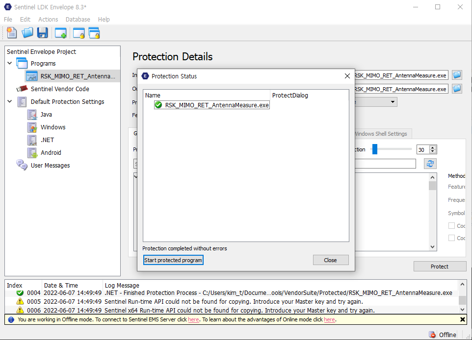

# 프로그램 라이선스 가이드

## JOB Name 규칙

- JOB`{Job Number}`.`{ProjectName}`
- `Job Number` : YYMMI(프로젝트가 만들어진 년도, 달, 인덱스 정보를 이용하여 Job Number부여)
- e.g : JOG22053.WifiTest

## 라이선스 설치 파일

경로 : T:\Transfer\김태훈\Thales\Sentinel-LDK_SDK\Windows
파일 : setup.exe

## 프로그램에 라이선스 적용 방법

1. Sentinel LDK 실행
2. Envelope 클릭
   
3. 좌측 메뉴의 `Programs` 메뉴 선택 후, 우측의 `Add Programs` 버튼 클릭
   
4. 좌측 메뉴에서 추가된 프로그램 이름 선택, Feature ID에 JobNumber입력 후 `Protect`버튼 클릭
   
5. 정상적으로 완료
   
6. 아래 경로에 만들어진 라이선스 파일 확인
   - C:\Users\{user}\Documents\Thales\Sentinel LDK 8.3\VendorTools\VendorSuite\Protected
   - haspdnert.dll, haspdnert_x64.dll, 라이선스 적용한 프로그램
   - 3개 파일을 인스톨쉴드에서 함께 설치되도록 적용
