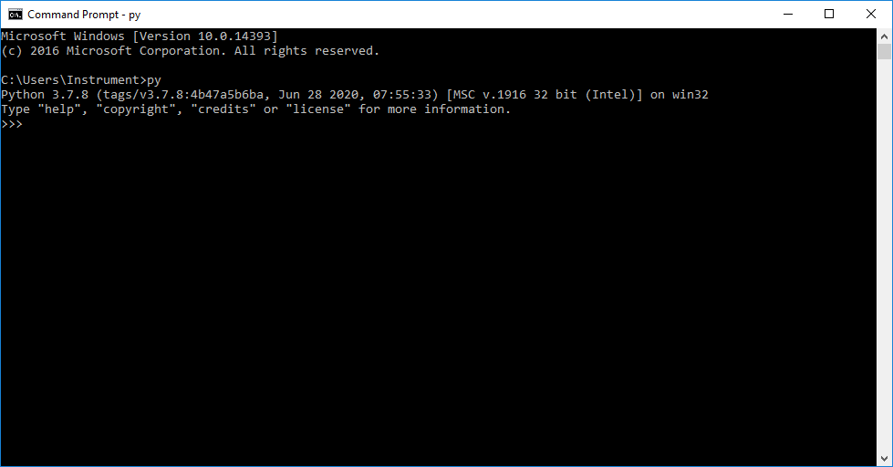

# Python Guide

## 설치

[Python 3.7.8](https://www.python.org/ftp/python/3.7.8/python-3.7.8.exe)

- Add Python 3.7 to PATH 체크 후 Install Now
  
- 설치 완료 후 cmd에서 py 명령어 동작 확인
  

[Visual Studio Code](https://code.visualstudio.com/docs/?dv=win)

- 파이썬 코딩을 위한 코드 편집기
- 설치 후 python extension 설치\
  

## 기본문법 연습문제

[자료형](https://wikidocs.net/42526)\
[제어문](https://wikidocs.net/42527)\
[입출력](https://wikidocs.net/42528)

## pip

파이썬으로 작성된 패키지 라이브러리를 관리해주는 시스템\
[PyPi](https://pypi.org/project/pip/)에서 패키지를 검색 할 수 있다.

### 패키지 설치하기

```
$ pip install <패키지 이름>
$ pip install pyvisa
```

### 패키지 제거하기

```
$ pip uninstall <패키지 이름>
```

### 설치된 패키지 확인

```
$ pip list
```

## 필수 패키지

### pipenv

- pipenv란
  pipenv는 파이썬에서 패키지를 프로젝트 단위로 관리할 수 있도록 도와주는 패키지 관리도구
  기본적으로 pip를 기반으로 동작하지만, 프로젝트 별로 격리된 가상 환경과 프로젝트 단위의 패키지 관리 메커니즘을 제공합니다.
  

- pipenv 설치

```
$ pip install pipenv
```

- pipenv 실행하여 가상환경 만들기

```
$ cd {project folder}
$ pipenv --python 3.7
```

- Pipfile 생성 확인, 프로젝트의 메타 정보가 저장됨

```
[[source]]
url = "https://pypi.org/simple"
verify_ssl = true
name = "pypi"

[packages]

[dev-packages]

[requires]
python_version = "3.7"
```

- 가상환경에 파이썬 패키지 설치

```
$ pipenv install pyvisa
```

Pipfile에 pyvisa가 자동으로 추가됨

```
...
[packages]
pyvisa = "*"
...

```

- 가상환경에 파이선 패키지 제거

```
$ pipenv uninstall pyvisa
```

- 가상환경에서 파이썬 파일 실행

```
$ pipenv run python test.py
```

### pyvisa

- [레퍼런스 사이트](https://pyvisa.readthedocs.io/en/latest/)
- 샘플 코드

```
import pyvisa as visa
from configparser import ConfigParser

c = ConfigParser()

c.read('.\settings.ini', encoding='utf-8')
host = c.get('instrument', 'host')
rm = visa.ResourceManager()
vi = rm.open_resource(f'TCPIP::{host}::INSTR')
idn = vi.query('*IDN?')

print(idn)
```

settings.ini

```
[instrument]
host=172.25.230.81
```

### pyinstaller

- 파이썬 파일(.py)을 실행파일(.exe)로 만들어주는 파이썬 패키지
- pipenv 가상환경에 설치

```
$ pipenv install pyinstaller --dev
```

- 가상환경의 패키지들을 포함하여 .exe파일 만들기

```
$ pipenv run pyinstaller --onefile --icon=RSKSW_Icon.ico test.py
```

기본 아이콘을 사용하는 경우 --icon옵션 제거하면 됨

- dist폴더에 test.exe파일 생성\
  

## 추천 패키지

### autopep8

- 코드 자동 정렬 패키지
- 설치 방법

```
$ pipenv install autopep8 --dev
```

- Visual Studio Code 설정

```
{
  ...
  "editor.formatOnSave": true,
  "[python]": {
    "editor.defaultFormatter": "ms-python.python"
  }
}
```

## RS 패키지

[RS 패키지](https://pypi.org/search/?q=rohde)
